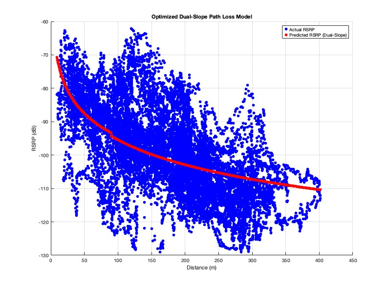

# Log Distance Propagation model:

Please refer this code [log distance propagation model](channel_propagation/s3_Idpl.m)

 

|Fitted Path Loss Exponent (n): | -2.5635 |
|-----|-----|
|MSE: | 113.4662 |
|RMSE: | 10.6521 |

# optimized log distance propagation model:

Here I tried to use dual slope path loss model having near and far effect.       

  
   
  Fig.1 *Predict RSRP with optimized dual slope model for various d0 (in metres) *

please refer this code [optimized log distance propagation model using dual slope model](matlab_codes/log_dist_propagation_model.m)

Best RMSE was obtained by heuristic analysis using upper and lower bounds. Also for better computation thereby maintaining optimum RMSE $lsqcurvefit$ was used.

key observations:

|Optimized Near Path Loss Exponent (n1):  |  2.2864 | 
|----|----|
|Optimized Far Path Loss Exponent (n2):   |  2.481  |

|Optimized Breakpoint Distance (db):     | 90    |

|Reduced RMSE with Dual-Slope Model:    |  10.1934  dBm |

