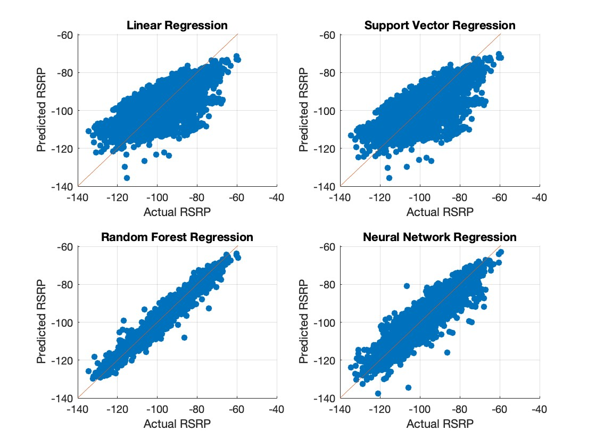
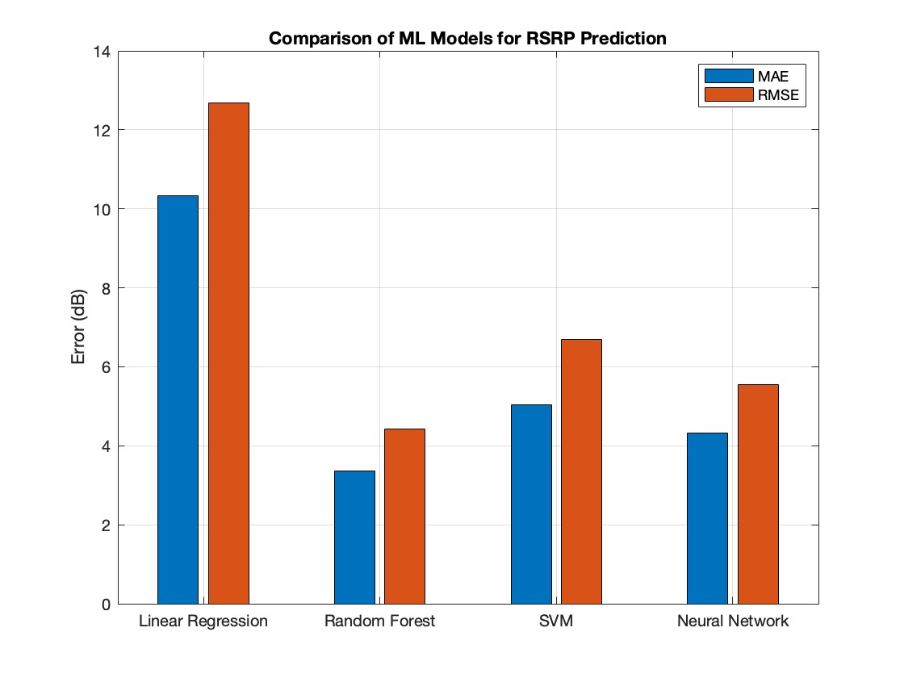
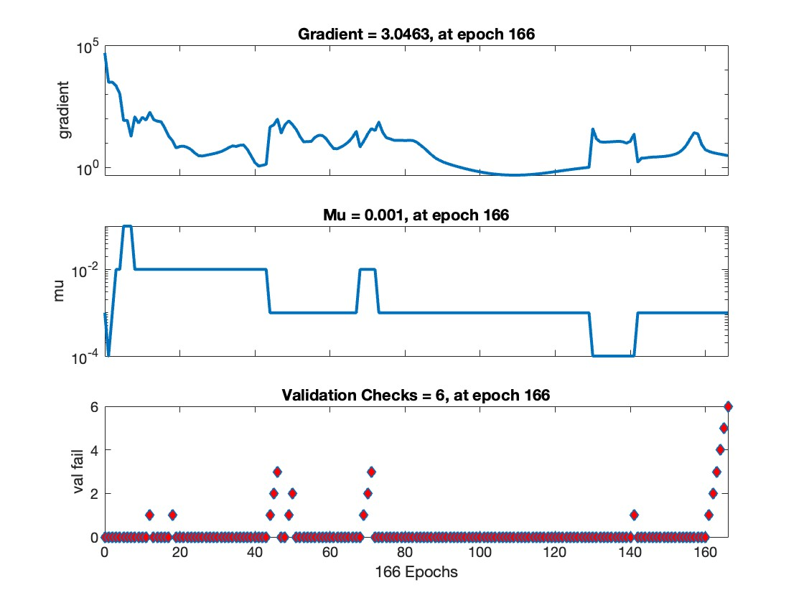
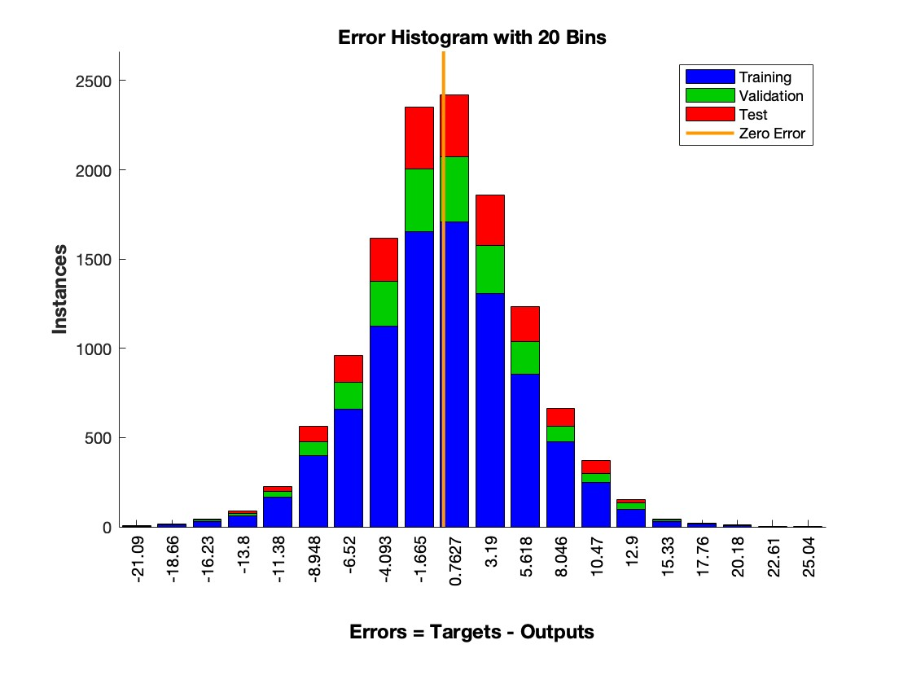
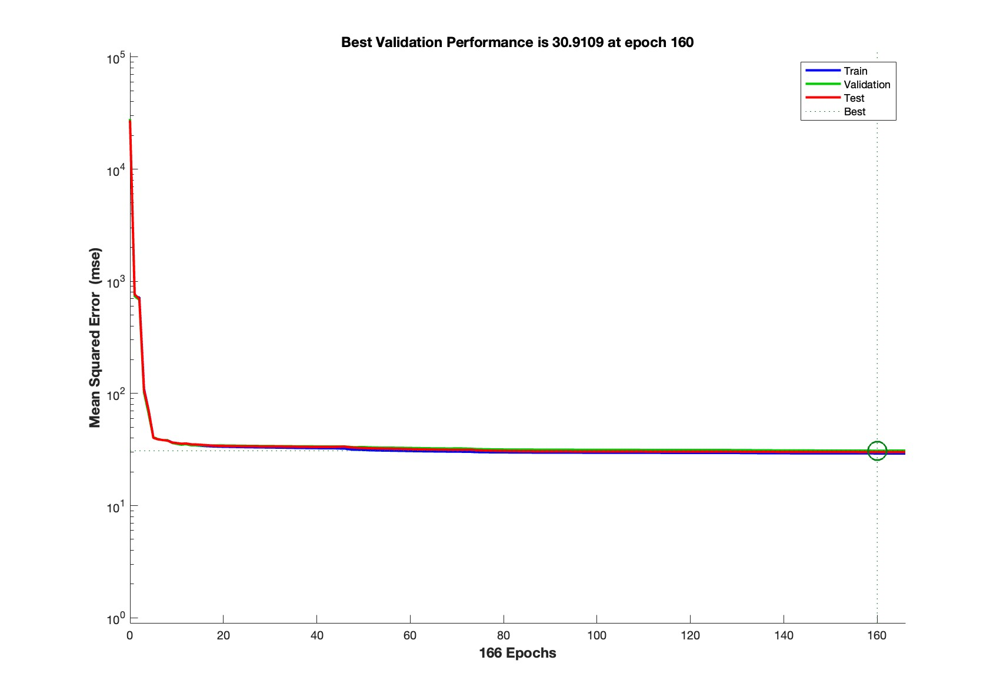
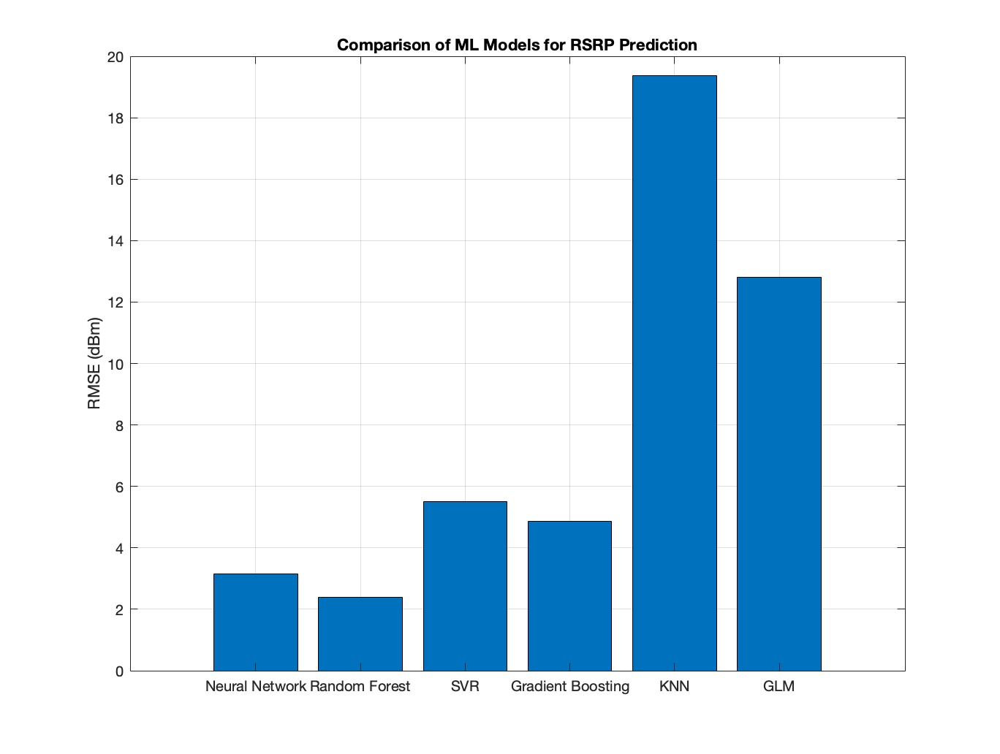
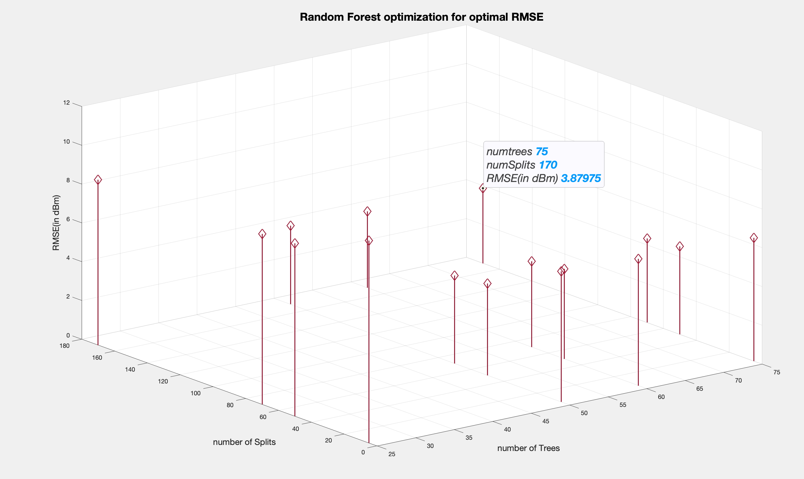

# ML models for RSRP prediction: #
 
	
*	Model Training:  
Four models are trained:  
	•	Linear Regression using fitlm  
	•	Support Vector Regression (SVR) using fitrsvm  
	•	Random Forest using TreeBagger (with out-of-bag prediction enabled)  
	•	Neural Network Regression using fitrnet  

*	Data Splitting:
The data is split into training (80%) and test (20%) sets using MATLAB’s cvpartition.
*	Evaluation:
Predictions are made on the test set for each model, and the RMSE (Root Mean Squared Error) is calculated to compare performance.
*	Visualization:
Scatter plots compare actual RSRP values versus predicted RSRP values for each model. The reference line y = x helps visualize prediction accuracy.
 

# Performance

random forest performs better than other three algos. reason being more number of decision trees are used in random forest. can be configured to match optimum error while retaining performance. Neural networks on other hand perform better but can be improved by increasing more number of hidden layers.

Below graphs illustrate error histogram and number of epochs required for obtaining minimum MSE.
hyperparamters used for fine tuning in random forests is number of decision trees.

	•	First Plot (Gradient vs. Epochs)
	•	The gradient is the rate of change of the error function.
	•	A decreasing gradient shows the model is converging.
	•	Second Plot (Mu vs. Epochs)
	•	Mu (learning rate adaptation factor for Levenberg-Marquardt training) changes over epochs to optimize convergence.
	•	Third Plot (Validation Failures vs. Epochs)
	•	Shows when validation performance did not improve.
	•	If failures reach the validation threshold (here, 6), training stops.

	•	The plot is divided into:
	•	Training data errors (Blue)
	•	Validation data errors (Green)
	•	Test data errors (Red)
	•	The orange vertical line represents zero error, meaning perfect predictions.
	•	The histogram shows that most errors are centered around zero, indicating a well-trained network, though some errors are significantly high.  
 

Here, The plot shows how the MSE reduces over time.
	•	The training stopped at epoch 166 because of validation performance criteria.
	•	The best validation performance occurred at epoch 160 with an MSE of 30.9109.
	•	This means after this point, further training did not improve validation performance, and early stopping was applied.
  
 

 This image contains four scatter plots, showing the relationship between the target (actual RSRP values) and output (predicted values from the neural network) for different datasets.

Each plot represents the correlation (R-value) between the actual and predicted values:
	1.	Top Left: Training Data (R = 0.9125)  
	•	Shows how well the neural network fits the training data.  
	•	The blue line represents the regression fit.  
	•	The dotted diagonal line (Y = T) is the ideal case where predictions perfectly match targets.  
	•	A high R-value (0.9125) indicates strong correlation, meaning the model has learned patterns well.  
	2.	Top Right: Validation Data (R = 0.90797)  
	•	This evaluates performance on unseen validation data.  
	•	The green line represents the regression fit.  
	•	The R-value is slightly lower than training (0.90797), indicating good generalization.  
	•	Since the validation R is close to training R, the model does not overfit significantly.  
	3.	Bottom Left: Test Data (R = 0.90968)  
	•	Shows model performance on completely unseen test data.  
	•	The red line represents the regression fit.  
	•	The R-value is 0.90968, close to training and validation, confirming strong generalization.  
	4.	Bottom Right: All Data Combined (R = 0.9114)  
	•	This combines training, validation, and test data to assess overall performance.  
	•	The black regression line fits all data points.  
	•	The high overall R-value (0.9114) suggests the model performs consistently across all datasets.  

 
        
# after fine tuning:
   Neural networks error is minimized.    
here in model graphs, RMSE of neural networks decreases by 1 to 1.5 dB after adding extra layer of hidden neurons.  

In MATLAB, the default training function for neural networks is Levenberg-Marquardt (trainlm).
* Levenberg-Marquardt is superior to other method(gradient with momentum and adaptive learning) in following ways:
  - Hybrid second-order method:
    - trainlm combines the advantages of Gauss-Newton and Gradient Descent, which allows it to efficiently adjust weights with minimal error.
    - It calculates an approximate Hessian matrix, which makes it much faster for small to medium-sized networks (in my dataset of elements upto 15k).

  - Fast convergence & better accuracy
    - Since it approximates second-order derivatives, it can quickly find a good minimum without being stuck in poor local minima.
    - Ideal for function approximation & regression problems, such as predicting RSRP values.

  - Handles small datasets well
    - Works well for moderate-sized datasets because it efficiently finds the best weights using second-order derivatives.

architeture with 50 and 25 neurons in hidden layer. this is fine tune Neural network architecture.

|Before Fine Tuning                        |                    After Fine Tuning           |
|:---------------------------------------:|:-----------------------------------------------:|
 |

  
* Correlation Coefficient (R values)
  - Training: R = 0.93373
  - Validation: R = 0.92421
  - Test: R = 0.92515
  - Overall: R = 0.93107
  - Since all R-values are above 0.92, given model has a strong linear relationship between the predicted and actual values, indicating a good fit.

* Regression Line Fit
  - The solid blue, green, red, and black lines represent the best linear fit to the data.
  - The dotted line (Y = T) is the ideal fit (perfect predictions).
  - Your model’s predictions are very close to the ideal fit, meaning it performs well.
* Bias in Predictions?
  - The regression equations show slight offsets (+13, +14), which means model might be slightly biased, but the high R-values suggest it’s still performing well.

## Measurements: ##

| Algorithmn  | MAE | RMSE  |
|----|----|----|
| Linear Regression  |   9.9985 |   12.394|
| Random Forest  |    2.8281   | 3.8075 |
| SVM  |  4.2522   | 5.5051 |
| Neural Network |   3.8284 |   5.2443 |
| NN after fine tuning | 3.38 | 4.32 | 

## after some more tuning and exploring other ML models:
  
   

|Model   |          RMSE |
|----|-----|
 |Neural Network   |    3.1425 |
 |   Random Forest |   2.3919|
   | Support Vector Regression               |   5.5004 |
   | Gradient Boosting |   4.8598 |
   |  KNN              |   19.363  |
   | GLM               |  12.817  |

refer [Ml models code](better_models.m)

## Hyperparameter Grid for tuning random forest ML model:

here I tune:
* Hyperparameters:
  - NumLearningCycles (number of trees in the forest)
  - numTrees    🔲: 25     🔲 50     :white_check_mark: 75
   
  - MinLeafSize (minimum number of samples per leaf)    
    ✅ 1  	🔲 2	    🔲4
  - MaxNumSplits (maximum depth of trees)    
    🔲20        🔲50      	 🔲70          	🔲100         ✅ 170
* remarks  
  - NumTrees ⬇️ (150  ➡️  50) : Fewer trees might be reducing overfitting.
  - MinLeafSize ⬆️ (2  ➡️  10) : Larger leaves can smooth predictions, reducing variance.
  - MaxNumSplits ⬆️ (20  ➡️  170) : More splits might help capture finer decision boundaries.
   

refer [optimized random forest code](random_forest_leafsize.m) 

