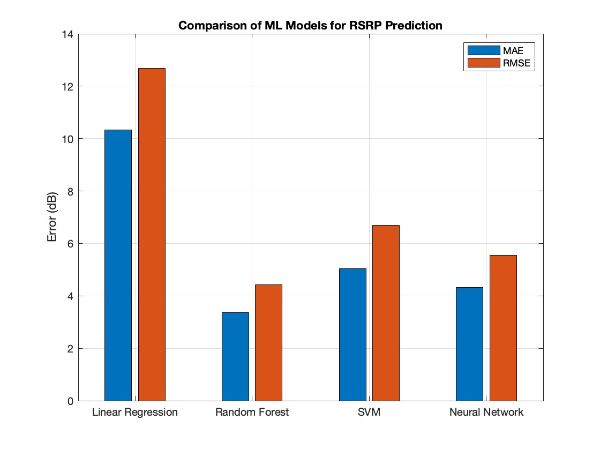

# ML learning models for RSRP prediction: #

models used here are random forest, neural networks, SVM and linear regression.

  

# performance

random forest performs better than other three algos. reason being more number of decision trees are used in random forest. can be configured to match optimum error while retaining performance. Neural networks on other hand perform better but can be improved by increasing more number of hidden layers.
Below graphs illustrate error histogram and number of epochs required for obtaining minimum MSE.
hyperparamters used for fine tuning in random forests is number of decision trees.

	•	First Plot (Gradient vs. Epochs)
	•	The gradient is the rate of change of the error function.
	•	A decreasing gradient shows the model is converging.
	•	Second Plot (Mu vs. Epochs)
	•	Mu (learning rate adaptation factor for Levenberg-Marquardt training) changes over epochs to optimize convergence.
	•	Third Plot (Validation Failures vs. Epochs)
	•	Shows when validation performance did not improve.
	•	If failures reach the validation threshold (here, 6), training stops.

	•	The plot is divided into:
	•	Training data errors (Blue)
	•	Validation data errors (Green)
	•	Test data errors (Red)
	•	The orange vertical line represents zero error, meaning perfect predictions.
	•	The histogram shows that most errors are centered around zero, indicating a well-trained network, though some errors are significantly high.
 

Here, The plot shows how the MSE reduces over time.
	•	The training stopped at epoch 166 because of validation performance criteria.
	•	The best validation performance occurred at epoch 160 with an MSE of 30.9109.
	•	This means after this point, further training did not improve validation performance, and early stopping was applied.

 

 This image contains four scatter plots, showing the relationship between the target (actual RSRP values) and output (predicted values from the neural network) for different datasets.

Each plot represents the correlation (R-value) between the actual and predicted values:
	1.	Top Left: Training Data (R = 0.9125)
	•	Shows how well the neural network fits the training data.
	•	The blue line represents the regression fit.
	•	The dotted diagonal line (Y = T) is the ideal case where predictions perfectly match targets.
	•	A high R-value (0.9125) indicates strong correlation, meaning the model has learned patterns well.
	2.	Top Right: Validation Data (R = 0.90797)
	•	This evaluates performance on unseen validation data.
	•	The green line represents the regression fit.
	•	The R-value is slightly lower than training (0.90797), indicating good generalization.
	•	Since the validation R is close to training R, the model does not overfit significantly.
	3.	Bottom Left: Test Data (R = 0.90968)
	•	Shows model performance on completely unseen test data.
	•	The red line represents the regression fit.
	•	The R-value is 0.90968, close to training and validation, confirming strong generalization.
	4.	Bottom Right: All Data Combined (R = 0.9114)
	•	This combines training, validation, and test data to assess overall performance.
	•	The black regression line fits all data points.
	•	The high overall R-value (0.9114) suggests the model performs consistently across all datasets.

# before Fine tuning Neural networks :

	

 
        
# after fine tuning:
   Neural networks error is minimized.    
here in model graphs, RMSE of neural networks decreases by 1 to 1.5 dB after adding extra layer of hidden neurons.

architeture with 50 and 25 neurons in hidden layer. this is fine tune Neural network architecture.

    

