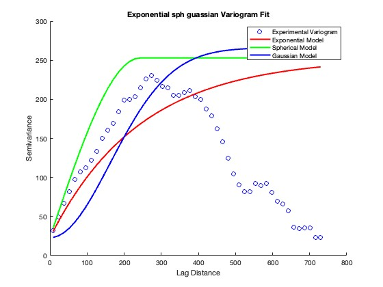
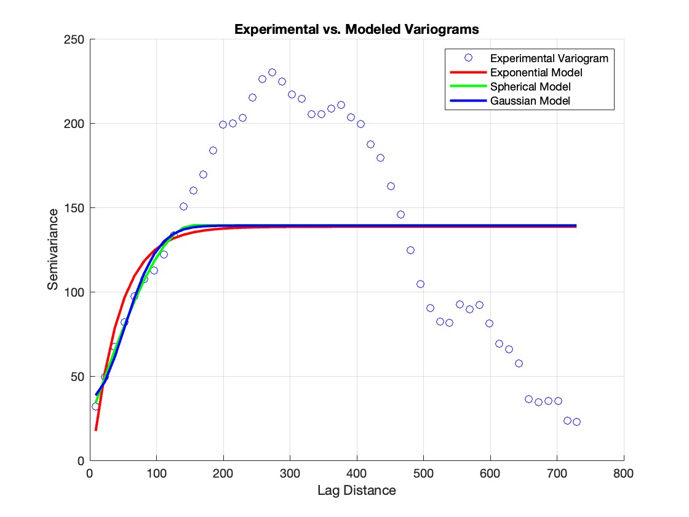
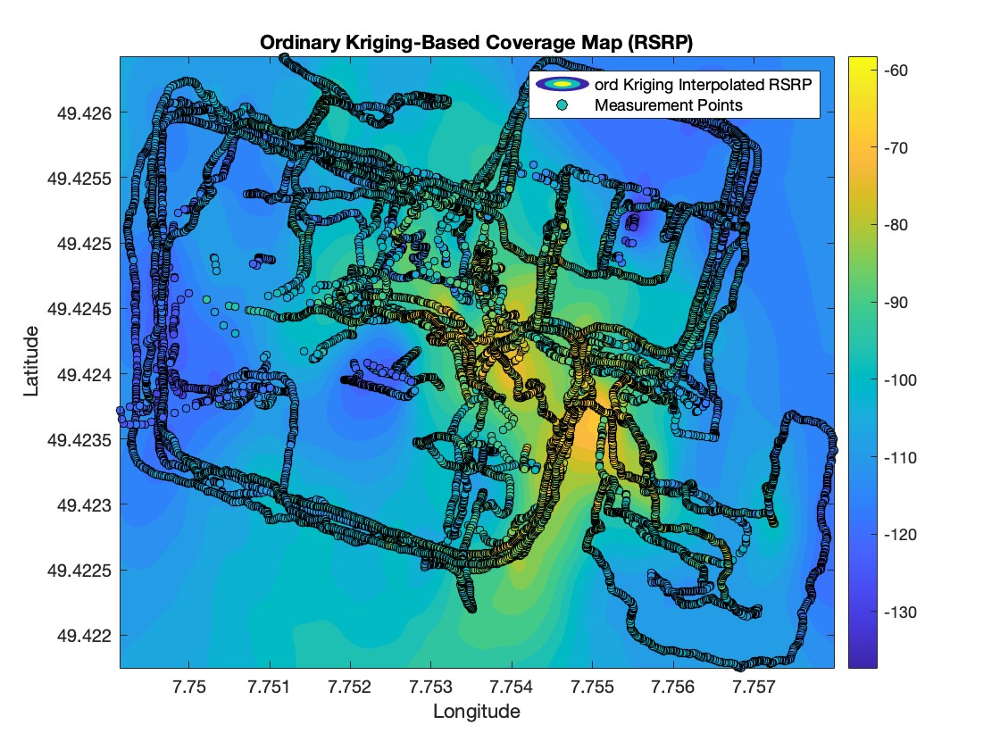

Steps:
1. Preprocess Data
	•	Check for missing or anomalous values in RSRP, SINR, and geospatial data.
	•	Normalize RSRP and SINR values for consistent scaling (optional).

2. Generate Coverage Maps


2.1 Baseline Map (Geospatial Interpolation)
	•	Interpolate RSRP values across the latitude and longitude grid using methods like Kriging or Inverse Distance Weighting (IDW).
	•	Generate a continuous coverage map over the geospatial area.

 difference between Kriging and Ordinary Kriging: 
 

 |Feature	|Kriging (General)   |	 Ordinary Kriging (OK)  |
|-----|-----|-------|
|Assumption	|Uses a known mean function for spatial trends.|	Assumes an unknown but constant mean over the study area. |
|Error Impact |	Can reduce error if the mean function is well-defined.|	Might have higher error if the assumption of constant mean is incorrect.|
|Bias	|Can be biased if the assumed trend function is incorrect.	|Less biased but may have higher variance in predictions.|
|Complexity |	More complex (requires defining a trend model).|	Simpler (no need for a trend model).|
 
 
Steps in kriging:


$$ \gamma(h) = \frac{1}{2N(h)} \sum_{i=1}^{N(h)} \left[ Z(x_i) - Z(x_i + h) \right]^2 $$

1️⃣ Experimental Variogram (γ(h))

The semi-variogram measures the spatial dependence between observations. It is computed as:


$$ \gamma(h) = \frac{1}{2N(h)} \sum_{i=1}^{N(h)} \left[ Z(x_i) - Z(x_i + h) \right]^2  $$


Where:
	•	 $\gamma(h)\$ = semi-variance for lag distance  h .
 
  •	 N(h)  = number of observation pairs separated by  h .

 •	 $Z(x_i)$ = measured value at location  x_i .

 2️⃣ Variogram Model (Exponential, Spherical, Gaussian)

To fit a theoretical model to the experimental variogram:

Exponential Model:


$$ \gamma(h) = C_0 + C \left(1 - e^{-h/a}\right)  $$


Spherical Model:


$$ \gamma(h) =
\begin{cases}
C_0 + C \left[ \frac{3}{2} \frac{h}{a} - \frac{1}{2} \left( \frac{h}{a} \right)^3 \right], & 0 \leq h \leq a \\
C_0 + C, & h > a
\end{cases}  $$


Gaussian Model:


$$ \gamma(h) = C_0 + C \left(1 - e^{-(h/a)^2}\right) $$


Where:
	•	$C_0$ = nugget (small-scale variation).
 

 •	 C  = sill (total variance).

 •	 a  = range (distance where spatial correlation vanishes).

# steps involved in computations of kriging process:
 
•	Step 1:
To load data for spatial coordinates (x, y) and measured values (rsrp_values).

 •	Step 2:
Computes the experimental variogram using compute_variogram function(refer OKD by various methods.m) with 50 bins, then optimizes the exponential variogram parameters using fminsearch and error function variogram_error.

•	Step 3:
Constructs the kriging system matrix. The matrix K is built from the variogram model evaluated on the distances between sample points. A row and column are appended to enforce the constraint that the weights sum to 1.

 •	Step 4:
Defines a regular grid (using meshgrid) over the extent of the data. The grid resolution is controlled by numGridPoints.

 •	Step 5:
For each grid point, the distances to all sample points are computed, and the corresponding variogram values are obtained. The kriging system (augmented with the Lagrange multiplier) is solved for the weights, and the predicted value is computed as the weighted sum of the sample values.

 •	Step 6:
The predicted values are reshaped into the grid format and plotted using contourf (or optionally imagesc).

Drawbacks of this method: Computationally expensive and also requires special multi core CPU's
Solution: Optimized code as given in (OKD by various methods)
Here I use Parallel computing toolbox and some matrix transformations like Cholesky decomposition:

problem 1:
weight w is singular:
fix:
```K_augmented = K_augmented + eye(size(K_augmented)) * 1e-6;```
where
each element in K represents the spatial relationship (covariance or semivariance) between two known data points (xi, yi) and (xj, yj).

$K_{ij} = \gamma(d_{ij})$
where:


•      $\gamma(d_{ij})$  is the variogram function (Exponential, Spherical, or Gaussian)


•	$d_{ij}$  is the Euclidean distance between points i and j   
 
problem 2:
Too much time consuming to execute code ~30 min

```w = K_augmented \ k_augmented;```

Fix:

w = lsqminnorm(K_augmented, k_augmented); % More stable least-squares solution;
R = chol(K_augmented + eye(size(K_augmented)) * 1e-6); % Regularization

```w = R \ (R' \ k_augmented); % Faster using Cholesky decomposition```

problem 3: NaN values in lambda 

Fix: Use Approximate Nearest Neighbors Instead of Full Matrix

1️Increase grid step size (step_size = 50 instead of 1 or 10)
2️ Use pdist2() for fast distance calculations (avoid loops)
3️ Use k-nearest neighbors (knnsearch()) to reduce problem size
4️ Enable parallel computing (parpool, parfor)
5️ Use Cholesky decomposition instead of matrix inversion

Optimized Code snippets:
```matlab
parpool; % Start parallel pool (if not already started)
num_points = numel(Xq);  % Number of grid points
predicted_rsrp = NaN(num_points, 1);

parfor i = 1:num_points
    % Find nearest neighbors
    [idx, dist] = knnsearch([x, y], [Xq(i), Yq(i)], 'K', num_neighbors);
    
    % Extract neighbor data
    x_neighbors = x(idx);
    y_neighbors = y(idx);
    rsrp_neighbors = rsrp_values(idx);
    
    % Compute distance matrix
    D_neighbors = pdist2([x_neighbors, y_neighbors], [x_neighbors, y_neighbors]);
    K_neighbors = variogram_model(D_neighbors);  % Compute variogram model
    
    % Solve Kriging system
    K_neighbors_aug = [K_neighbors, ones(num_neighbors, 1); ones(1, num_neighbors), 0];
    K_neighbors_aug = K_neighbors_aug + eye(size(K_neighbors_aug)) * 1e-4; % Regularization

    k_neighbors = variogram_model(dist'); % Compute covariances for prediction point
    
    % Solve for weights (lambda)
    lambda = K_neighbors_aug \ [k_neighbors; 1];

    % Compute predicted RSRP
    predicted_rsrp(i) = sum(lambda(1:end-1) .* rsrp_neighbors);
end
```

# Simulations:
<br>



<br>
optimized model by combining exponential gaussian and spherical model for some lag distance upto 150.



fits well.

refer [Comparison of variograms code](matlab_codes/various_variograms.m)

<br>




refer [Kriging_interpolation code](matlab_codes/Kriging_interpolation_coverage_map.m)

$$ RMSE =  \sqrt{\frac{1}{N} \sum_{i=1}^{N} (RSRP_{\text{true}, i} - RSRP_{\text{pred}, i})^2}   $$

|RMSE of Kriging: | 17.52 |
|----|----|
|OKD with exponential variogram configuration: |16.29 |


